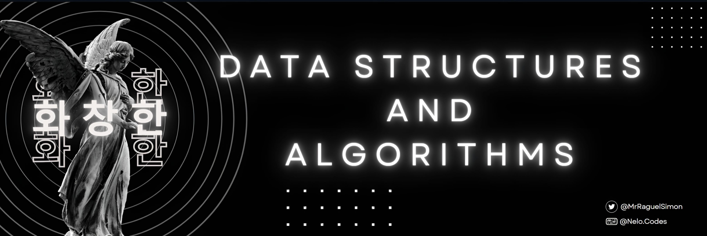

<!-- Start of README.md -->

# 💫 About Me:
• Enthusiastic about technology and deeply captivated by design aesthetics, I am an undergraduate embarking on a journey in field of  computer science engineering.  
• Presently, I am engrossed in the study of DSA (Data Structures and Algorithms), employing the versatile language of C++.  

# 🤔 Why am I here?
• My GitHub repository serves as a meticulously kept journal, offering an open resource for those seeking to dive into programming from its foundational stages.  
• I'll try my best in maintaining a steady stream of code uploads, each accompanied by concise explanations to ensure accessibility for beginners.  

# 👨🏻‍💻 Languages:

---

_🥰 Thank you for taking the time to read this far! Your attention is greatly appreciated.   **Incase you're interested, Join me on this voyage for more insightful content!!**_

<!-- End of README.md -->
